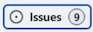

## Working with GitHub Issues

_In this section you'll learn the basics of GitHub issues, including issue creation, issue templates, working with labels and milestones, assignment, querying issues, issue hierarchies, issue types, and cross-repo collaboration._

### Getting started with GitHub Issues

- [ ] Create your first issue, based on the "Build Lab-Issue Basics template" issue template using the default settings.
  - Click the **Issues** tab in the top navigation bar of your GitHub repo in the browser ().
  - Click the green **New Issue** button on the right side of the browser screen.
  - Select the **Build Lab-Issue Basics template**.
  - Review markdown used in the "Description" to format content.
  - Click the **Preview** tab for the "Add a description" text area to preview the markdown.
  - Click the green **Create** button near the bottom of the form.  The template you selected already had everything filled out so you don't need to make any changes. 

> [!TIP]
> If you aren't already familiar with markdown you can refer to the [GitHub docs](https://docs.github.com/en/get-started/writing-on-github/getting-started-with-writing-and-formatting-on-github) for more information.

- [ ] Assign the new issue to yourself.
  - On the right side of the issue, locate the **Assignees** section and click the **Assign to yourself** link. Alternatively, you can click the gear button ( in that section and search/filter/select to add assignees.

- [ ] Apply the "enhancement" label to your new issue.
  - Again in the right side, locate the **Labels** section.
  - Click the gear icon in that section and select the **enhancement** checkbox.
  - Click outside the selection area to close the menu.
  
> [!TIP]
> Currently, only the default labels are available.  If you're interested in how to create and manage labels in GitHub, refer to the [GitHub docs](https://docs.github.com/en/issues/using-labels-and-milestones-to-track-work/managing-labels).
<!--
- [ ] Apply the "Build 2025 Sprint" milestone to your new issue. ***TODO - Either prepopulate Milestones, add the steps to generate it, or remove this step***
  - Using the same process described above, select the gear and then assign the Milestone.
  - Normally the milestone list defaults to empty, but we prepopulated the available labels for this lab.  Refer to the [GitHub docs](https://docs.github.com/en/issues/using-labels-and-milestones-to-track-work/about-milestones) if you'd like to learn more.
-->
- [ ] Query issues to find and filter this issue and others in your repo.
  - In the top-nav section of the page, click on the **Issues**.  This will return a list of all open issues.  Note that we have prepopulated a numerous issues for this workshop so that you'll have more to work with in later exercises.
  - Notice the filter text bar; it defaults to the text `is:issue state:open`.  Change that text to include text to filter for the enancement label (i.e., `is:issue state:open label:enhancement`) and press <kbd>Enter</kbd>.  Notice that the list shortens to only show the issues labeled "enhancement".
  - You can also filter using the dropdowns for **Author**, **Labels**, **Projects**, **Milestones**, **Assignees**, and the **Open** and **Closed** buttons.  Click on the **Labels** dropdown and clear the enhancement checkbox to return to the original query; click outside of the dropdown to apply the changes.
  - Feel free to play around with the filtering; if you'd like more information on filtering with Issues, refer to the [GitHub docs](https://docs.github.com/en/issues/tracking-your-work-with-issues/using-issues/filtering-and-searching-issues-and-pull-requests).
