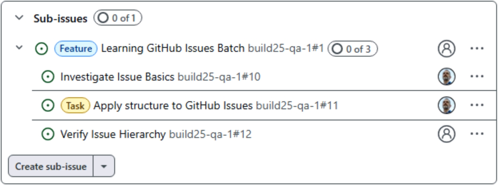

### Structuring GitHub Issues

_Most development teams need more than simple issues to manage development procedures. We've prepopulated a few more issues in your repo so that you can apply issue types and parent/child relationships._

- [ ] Create a new issue titled "Apply structure to GitHub Issues" using the blank issue template, with a **Task** Type and assigned to you.
  - This is the same process as in the last exercise, using the green **New issue** button except that:
    - You'll need to select the **Blank issue** template, and...
    - You'll need to enter the title `Apply structure to GitHub Issues`.
    - If you'd like to practice your Markdown, you can optionally enter a description.
  - Scroll to the bottom of the form and notice there are buttons such as **Assignee**, **Label**, etc.  Click the **Assignee** button and assign it to yourself. Again, click outside to popup menu to dismiss it.  This is an alternate way from the last exercise to set issue data during the creation process.
  - Repeat the process to set the **Issue Type** to **Task**. 
  - Click the green **Create** to complete the creation process.

> [!TIP]
> Issue Types are available in [GitHub organization accounts](https://docs.github.com/en/get-started/learning-about-github/types-of-github-accounts) but not User accounts.

- [ ] Locate the "Learning GitHub Issues Batch" issue, change it's type to Feature.
  - Click the **Issues** tab on the top nav of the page to return to the Issues list. You can add the text "Learning" to the filter text to do a text search for the issue (i.e., `is:issue state:open Learning` and <kbd>Enter</kbd>).
  - Click on the "Learning GitHub Issues Feature" issue to open it.
  - Locate the **Type** section on the right side of the form; use the gear icon to select the **Feature** type.

> [!TIP] 
> GitHub defaults to types "Task", "Bug" and "Feature", but you can easily [create your own issue types](https://docs.github.com/en/enterprise-cloud@latest/issues/tracking-your-work-with-issues/configuring-issues/managing-issue-types-in-an-organization).

- [ ] Add a new Task titled "Verify Issue Hierarchy" as a child of this feature.
  - With the "Learning GitHub Issues Feature" issue still open, click the **Create sub-issue** button.
  - Select **Blank Issue** as the template and enter `Verify Issue Hierarchy` as the title.
  - Set the **Issue Type** to **Task** and click the **Create** button.
- [ ] Add the Task issues that you created earlier as children of this Feature.
  - Click the dropdown arrow (image) on the **Create sub-issue** button, and select **Add existing issue**.
  - Locate and select the "Investigate Issue Basics" task; you can use the **Search issues** text box if it is difficult to locate.
  - Repeat the process to add the existing "Apply structure to GitHub Issues" task.
  
> [!TIP]
> In an issue hierarchy, you can drag the handle to the left of the child issues to reorder the issues.

- [ ] Add a parent Issue from a different repo.
  - One of the powerful capabilities in GitHub Issues it the ability to seamlessly track work between repos. In the right column of the issue form, locate the "Relationships" section and click the gear icon.
  - Click **Add parent**
  - Notice that above the Search issues text there is an arrow with your repo name (e.g., <-- my-org/my-repo). ***TODO - Specify correct parent issue repo***
  - Click on the **left arrow** () to search for a different repo, and enter the text `Lab302-Template`.
  - Select the **Lan302-Template** repo and then select the **Parent of all labs** issue as the new parent.
- [ ] Verify the issue hierarchy
  - On the right side of the issue form, click on the parent issue that you just configured; this will open the parent issue that you just configured.
  - From the parent issue, click the Expand/Collapse button next to your issue and verify the hierarchy is similar to the following and contains your issues:
    
    Note that you may actually see issue hierarchies for other workshop participants; that is fine, as long as you can find the issue hierarchy that is associated with your repo.
  - Click on the **Verify Issue Hierarchy** issue title to open that issue.
  - On text area near the bottom of the form, enter `Verification Complete` and click the **Close with comment** button.
  - Click on the **X** in the top-right of the form to dismiss it.
  - Verify that in the hierarchy, the verification issue is now marked as closed ().  We could go back and close the other Tasks and the Feature itself as we've completed those exercises.  But there is a more efficient way that we'll explore in the next exercise.

In this exercise you've seen how issues can have types, parent-child relationships, and cross-repo linkage. Unlike some other systems, issue types are easily changed and we don't inherently force issue hierarchies by type (e.g., you could have a task that is a parent of a feature which is a parent of a bug)... how you track work is easily maleable to the way YOU want to work!
