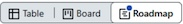

## Working with Project Views
_One of the valuable components in Projects is the ability to customize how you view and interact with a group of related work. In this exercise we will filter, slice, and create a variety of different project views._

### Filter Project Data
If you're not already there, access the project board and the default view.  If you modified the filters for the view, click **Discard** to return to the initial settings.
- [ ] Rename the first view as "Feature Planning".
  - Locate the tab with the default name "View 1".
  - Double-click on the **View 1** text; delete the existing name and replace it with the title `Feature Planning`.
- [ ] Add a filter to only show "Feature" and "Bug" type issues and display the "Type" field.
  - In the filter textbox with the magnifying glass icon (image), enter the text `Type:Bug,Feature`.
  - Click on the green **Save** button to the right of the filter textbox to save your changes. 
  - Click on the dropdown button on the **Feature Planning** tab (), select **Fields** > **Type**.
  - Click on the green on **Save** button in the "Layout" popup to save the displayed field; notice that the type is now shown in a new column in the table.

> [!TIP]
> To make things easier to read, you can easily resize and reorder columns to suite your preferences. If you do reorder columns, you should click **Save** to keep your changes.

### Add a Release Roadmap view
- [ ] Populate Feature issues with priorities and dates; using the existing "Feature Planning" view, set the Priority, Start and End dates in the grid as:
  | Issue title | Priority | Start-End dates |
  |---|---|---|
  | "Learning GitHub Issues..." | High Priority | May 12-May 16, 2025 |
  | "Exercise Project Fudamentals" | Medium Priority | May 15-May 21, 2025 |
  | "Fix the typo in the README file | Medium Priority | May 21-May 23, 2025 |

- [ ] Duplicate the current view with the name "Release Roadmap", the type "Roadmap", scaled to "Quarter" and sorted by "End".
  - Click the dropdown button on the **Feature Planning** view.
  - Click on **Duplicate view**.
  - Double-click on the new view tab title (e.g., "View 2") and rename it to `Release Roadmap`.
  - Click the dropdown button on the **Release Roadmap** tab  view and select the Roadmap button () at the top-right of the popup.
  - Change the **Month** scaling button () to **Quarter** so that you can see a longer timeline.
  - Change the **Sort** button () to use the **End** date field.
  - Click the green **Save** button next to the filter textbox.
- [ ] Adjust release dates
  - Drag the "Exercise Project Fundamentals" issue so that it starts immediately after the "Learn GitHub Issues Batch" is complete.
  - Drag the right side (end) of the "Fix the typo in the README file" issue so that it is only one day in duration.
  - Hit the **+** button next to "Customize Status and Fields" issue; drag and stretch the issue so that it is a few days duration, starting after the "Fix the typo in the README file" issue.

### Add a Board view for tasks
- [ ] Add a new view named "Task Board" with the type "Board", filtered to show tasks and untyped issues.
  - Click the **+ New view** button next to the "Release Roadmap" tab and select the **Board** view.
  - Rename the new tab to `Tasks`.
  - In the "Filter by keyword or by field" textbox enter `-Type:Feature,Bug`; note that dash is used to indicate the Boolean logical "not". We're using this notation on the types so that we can pick up untyped issues in addition to Tasks.
- [ ] Add a "Parent issue" slicer, group by "Assignees", and add "Labels" to the fields.
  - Click the dropdown next to the **Tasks** tab, then the **Slice by:** button, and select **Parent issue**.
  - Repeat the process to add a **Group by:** with the value **Assignees**.
  - Repeat the process, selecting **Fields:** and adding the **Labels** field. A couple of the prepopulated tasks have labels which you should now see on their cards.
  - Click the green **Save** button to save changes.
- [ ] Verify board interactions
  - Drag one of the issues from the "No Assignees" group into your assignee row; verify that it is now assigned to you (i.e., the user icon on the top-right of that card).
  - Click on the **Learning GitHub Issues** parent issue; verify that it filters only show the three child issues assigned to that parent.
  - Click on that parent issue again, or click on **deselect** in the slicer, and verify that all cards are shown again
  - Drag the "Investigate Issue Basics" issue to the "Done" column
  - Verify that the **Learning GitHub Issues Batch** in the Parent issue has been updated to show "2 / 3" or 66% complete.
  - Verify that the issue status icon on the "Done" card has changed from an open () to closed ().
  
  NOTE: The fact that the issue was closed when it was dragged to "Done" was not through magic; it happend through automation... which we'll investigate next!

  
