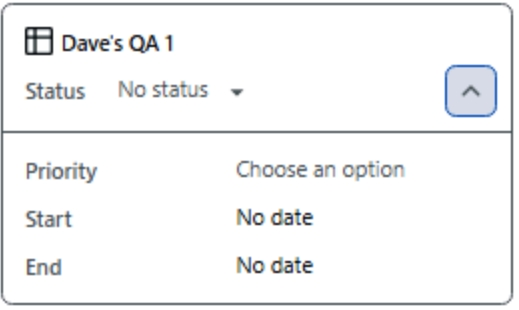
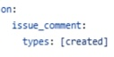

## Projects and Automation
_As noted in the last exercise, the act of closing an issue and changing the a project status are different things, but automation enables us to couple them. In this exercise we'll work with the built-in automations and explore the other ways that Issues and Projects can be automated._

### Explore built-in workflows
- [ ] Access the "Workflows" project settings and review currently active automations.
  - While viewing the project, click on the elipses (**...**) button in project settings () on the top-right of the page.
  - Click on **Workflows**.
- [ ] Review the active default workflows.
  - Review the list of "Default workflows" on the left side of the page.  Notice that the green dot identifies active workflows.
  - Click on the **Item closed** workflow and review the actual workflow; it provides a simple event flow, where when the event in the top box occurs, it triggers the activity in the lower box.  In this case, if an issue orpull request in the project is closed, it will be set to a "Done" status.
  - Click on and review the **Auto-close issue** workflow.  This is the automation that we used in the last exercise: when a status is changed to "Done", the underlying issue is closed.
- [ ] Add a workflow to automatically add new issues or PRs to this project.
  - Click on the "Auto-add to project" default workflow.
  - Click the Edit button near the top-right of the page.
  - Ensure that your repo is selected in the Filters section of the top box.
  - Change the filter to remove the label, so that the new filter text is `is:issue,pr is:open`; in this workshop we've been using purely issues but in the next exercise we'll look at PRs.
  - Click the **Save and turn on workflow** green button on the top-right of the page.
- [ ] Add a new "Verify project automation" issue to verify the automation.
  - On the top-nav of the page, search for your repo by entering portions of the name.  Select your repository name to **jump to** to it.
  - Click on the **Issues** tab and then click the green **New issue** button.
  - Use the **Blank issue** template with the issue title `Verify project automation`; click **Create** to save the new issue.
  - In the right column of the newly created issue, verify that your project is visible in the "Projects" section.  The fact that it shows up verifies that the automation has run and this issue was added to the project.
  - Expand the project box to reveal the custom project fields, for example:
    .
    
> [!TIP]
> You can manipulate any of the custom project fields directly from this area of an issue. 
> [!TIP]
> Issues can also appear on multiple projects, each with their own custom fields. 

### Review advanced automation options
- [ ] Review API and command line automation options.
  - The [GitHub CLI](https://cli.github.com/) provides commands to directly [read and manipulate Issues](https://cli.github.com/manual/gh_issue) and [Projects](https://cli.github.com/manual/gh_project).
  - GitHub provides powerful REST APIs to programmatically interact with [Issues](https://docs.github.com/en/rest/issues); you can call these from the programming language of your choice, a variety of tools, and/or the GitHub CLI.
  - In addition, GitHub provides GraphQL APIs for both [Issues](https://docs.github.com/en/issues/planning-and-tracking-with-projects/automating-your-project/using-the-api-to-manage-projects) and [Projects](https://docs.github.com/en/issues/planning-and-tracking-with-projects/automating-your-project/using-the-api-to-manage-projects).
- [ ] Review the scripted Issues automation used in this lab.
  This lab used the GitHub CLI in a script to create issues, set their types, and associate parent-child relationships.  Review the "prepare-lab-env.sh" script to learn how the CLI was used to create and manipulate issues, both directly and via the REST APIs.
  - Return to your repo in the browser; if you are already viewing the issue from the last exercise, you are there.  If not, you can use the browser back button or the GitHub menu in the top-left of the page.
  - Click on the **<> Code** button in the top-nav of the page.
  - Click on the **.github** folder and then into the **scripts** folder.
  - Click on the **prepare-lab-end.sh** file to review the contents. Lines 12 shows an example of directly creating an issue with the GitHub CLI.  Line 111 shows calling an API via the GitHub CLI to set the issue ttype.  Line 135 shows creating a parent/child relationship.
- [ ] Review and verify the "issue-ping" GitHub Actions workflow
  - On the left-nav for the page, drill into the ".github/workflows/" folder; if you don't see the left-nav you can click on **workflows** link on the breadcrumbs under the top-nav.
  - Click on the **issue-ping.yml** file; GitHub Actions supports a wide variety of triggers for [Issues](https://docs.github.com/en/actions/writing-workflows/choosing-when-your-workflow-runs/events-that-trigger-workflows#issues).  Note that this workflow triggers when an issue comment is created:
  
    

    Review the rest of the short workflow file to see you simple it can be to automate based on issue triggers.
  - From the top-nav of the page, click on the **Issues** tab.
  - Drill into an issue (it doesn't matter which one) and add the comment `ping` to the text area near the bottom of the form.
  - Click on the green **Comment** button below the textarea.  This will trigger the actions workflow we reviewed earlier.  It may take a few moments to complete but the workflow will add a response comment "pong" to the issue.
  - If you wish, you can wait for it to complete, and/or you can click on **Actions** tab in the top-nav and watch/review the workflow logs for this automation.

