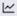
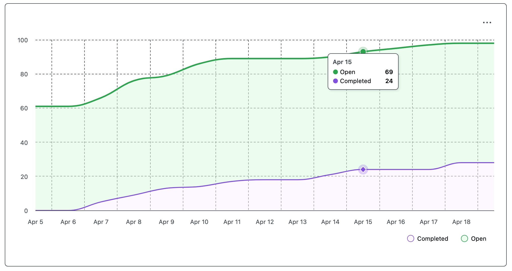
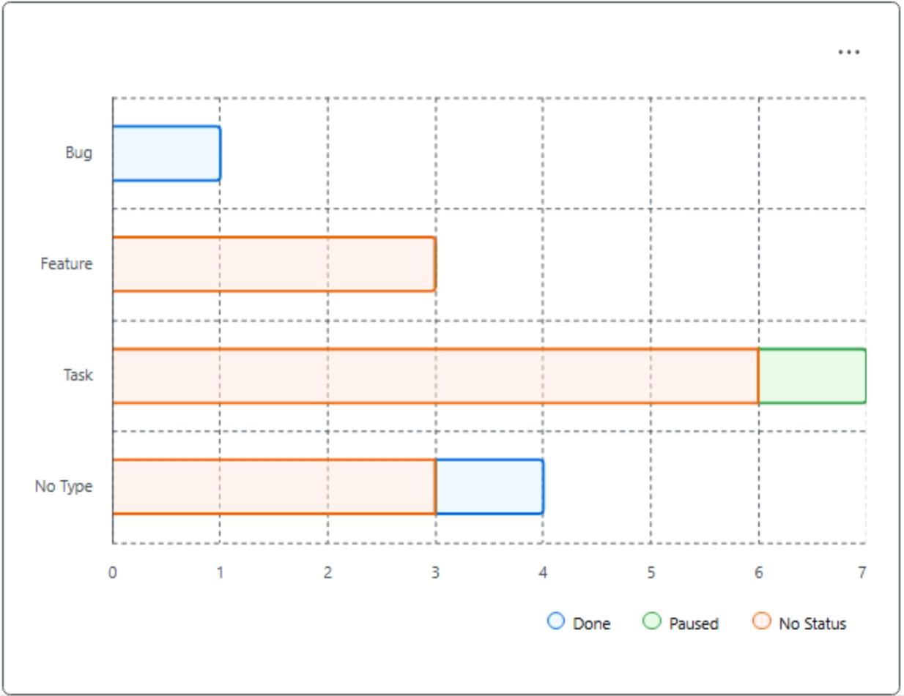

## Gathering Project Insights
_GitHub offers a rich array of APIs and logging mechanisms to build your own data warehouse and custom reports.  However, not everyone has the time or interest in such an endeavor, so we also offer basic reporting out-of-the-box!_

### Investigate Insights
- [ ] Browse to the Project Insights and review the default "Burn up" chart.
  - If not already there, browse to your Project.
  - In the top-right of the page, click on the **Insights** button () in the project setting.
  - Review the default "Burn up" chart.  Since this is a time-based chart and the lab is likely within a single day, it is likely that this chart is fairly boring.  The following shows a sample of an actual production burn up chart with the default settings.  This is just for reference - your chart will **NOT** look like this:
  
  - Note that you can easily change which project items are captured by changing the filter text (e.g., `is:issue Status:Paused`) to report on any project fields.  Also note that for time-based charts you can customize date ranges; the default is for the most recent 2-weeks.
- [ ] Create a "Issue status by type" Stacked bar chart.
  - On the left side of the page, click on the **+ New chart** button.
  - Click the **Edit the chart name** () and enter the name `Issue status by type` and click **Save**.
  - Click on the **Configure** button on the top-right of the page.
  - Click on the dropdown menu under "Layout" and review the options; select **Stacked bar**.
  - Click on the **X-axis** dropdown and review the options; select **Type**.
  - Click on the **Group by (optional)** dropdown and review the options; select **Status**.
  - Click on the **Y-Axis** dropdown and review the options.  Note that only the currently selected "Count of items" is available; the remaining options require that the target field (e.g., Status) be a numeric type (e.g., a customer "Story points" or "Effort" field).
  - Click the **Save** button in the "Configure chart" form.  If it is hidden by the "Y-axis" menu, click outside of the menu. 
  - Finally, enter the value `is:issue` in the filter textbox so ensure only issues are reported and click the **Save** button.

Although your results will vary based on the specifics of earlier exercises, your resulting Insights chart should look similar to this:

